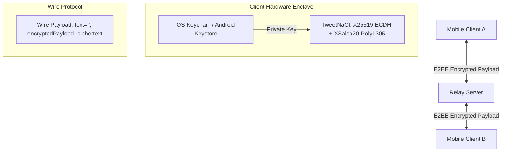

# JABY Secure Messenger — Mobile App

[](https://tweetnacl.js.org/)
[](https://reactnative.dev/)
[](https://expo.dev/)
[](https://www.typescriptlang.org/)
[](#license)

JABY is an ultra-secure, privacy-first mobile messaging client built with **React Native**, **Expo**, and **TweetNaCl**. It provides military-grade end-to-end encrypted (E2EE) messaging, zero-knowledge cloud backups, WebRTC encrypted voice and video calling, ephemeral disappearing messages, Android OS floating chat heads, native push notifications, and plausible deniability with dual-PIN duress protocols.

---

## Table of Contents
- [Architecture & Cryptography](#architecture--cryptography)
- [Key Features](#key-features)
- [Project Directory Structure](#project-directory-structure)
- [Prerequisites & Environment Setup](#prerequisites--environment-setup)
- [Running the App](#running-the-app)
  - [Development (Expo Go)](#development-expo-go)
  - [Native Android Build](#native-android-build)
  - [Native iOS Build](#native-ios-build)
- [Security Model & Protocols](#security-model--protocols)
  - [Zero Plaintext on the Wire](#zero-plaintext-on-the-wire)
  - [Key Storage & Enclave Isolation](#key-storage--enclave-isolation)
  - [Plausible Deniability & Duress Mode](#plausible-deniability--duress-mode)
  - [Cryptographic Backup Escrow](#cryptographic-backup-escrow)
  - [WebRTC VoIP & SAS Verification](#webrtc-voip--sas-verification)
- [Native Android Modules](#native-android-modules)
- [Verification & Quality Assurance](#verification--quality-assurance)

---

## Architecture & Cryptography



JABY operates under a **Zero-Knowledge Architecture**:
- **Identity & Key Agreement**: Curve25519 / X25519 Elliptic Curve Diffie-Hellman (ECDH).
- **Authenticated Symmetric Encryption**: XSalsa20 stream cipher with Poly1305 MAC authenticator (`nacl.box` / `nacl.secretbox`).
- **Key Derivation (KDF)**: PBKDF2 with HMAC-SHA256, strictly enforcing **100,000 iterations** with a 16-byte cryptographically secure random salt and minimum 8-character passphrases.
- **SAS Audio/Video Verification**: 4-word Short Authentication String (SAS) derived from SHA-256 hashed ECDH shared secrets and synchronized session timestamps, protecting against Man-in-the-Middle (MITM) attacks during WebRTC calls.
- **Hardware-Backed Key Storage**: Real private key material is stored exclusively in the OS Keychain/Keystore via `expo-secure-store` with `WHEN_UNLOCKED_THIS_DEVICE_ONLY` access policies.

---

## Key Features

### 1. End-to-End Encrypted Messaging
- **Zero Plaintext Wire Dispatches**: All outgoing messages over HTTP and WebSocket emit empty string payloads (`text: ''`) alongside signed `encryptedPayload` ciphertexts.
- **Cryptographic Cipher Inspector**: View raw ciphertext payloads, nonces, and sender public keys directly within the app, with an automated 30-second clipboard wipe timer.
- **Ephemeral Disappearing Messages**: Messages self-destruct locally and remotely after a configurable timer (5 seconds up to 7 days, including custom hour:minute pickers). Managed through a single shared global timer to eliminate CPU and battery drain.

### 2. Encrypted Voice & Video Calling (WebRTC)
- Real-time peer-to-peer audio and video calling powered by `react-native-webrtc`.
- Secured with TLS-encrypted TURN relays (`turns:openrelay.metered.ca:443?transport=tcp`).
- Real-time cryptographic SAS word matching to verify caller identity out-of-band.
- StrictMode-safe state management with automatic call cleanup on unmount.

### 3. Voice Messages & Audio Notes
- Studio-quality audio recording with live waveform visualization.
- Lock-to-record hands-free mode, discard gestures, and preview playback.
- Variable playback speeds (1x, 1.5x, 2x) with smooth audio track switching.

### 4. Plausible Deniability & Duress Protocols
- **Dual-PIN Architecture**: Primary Passcode opens your authentic account; an Emergency Duress PIN triggers defensive actions under coercion.
- **Decoy Vault**: Entering the Duress PIN seamlessly switches the app into a fully isolated decoy identity with simulated contacts and innocuous message histories. Real contact requests, search operatives, linked devices, invite codes, safety numbers, and cloud backups are completely suppressed.
- **Emergency Zeroize Wipe**: Instant panic button zeroizes all session tokens, private keys, and historical keyrings across all accounts ever registered on the device.

### 5. Native Chat Heads (Android)
- Floating bubble overlay that renders over the Android OS and third-party apps, similar to Facebook Messenger.
- Implemented natively via `ChatHeadService.kt` and `ChatHeadModule.kt` using `SYSTEM_ALERT_WINDOW`.
- Integrated fallback in-app overlay for platforms without draw-over-apps permissions.

### 6. Push & In-App Notification System
- Native Android Notification Channels:
  - `jaby_channel_messages`: High importance, vibration, LED indicators, private lockscreen visibility.
  - `jaby_channel_calls`: Max importance, ringtone sound, heads-up display.
  - `jaby_channel_security`: Critical security alerts (key mismatches, safety number changes, device links).
- Interactive top-dropping in-app notification toasts (`InAppNotificationBanner.tsx`) with direct reply, call accept/decline, and security alert inspection.

### 7. Zero-Knowledge Cloud Backup & Key Escrow
- Complete identity keypair and historical keyring escrow encrypted client-side with PBKDF2-HMAC-SHA256 before upload.
- Decoupled from login PINs to prevent brute-force recovery.
- Strict payload size bounds (2MB maximum) and iteration enforcement to prevent denial-of-service vulnerabilities.

---

## Project Directory Structure

```
mobile/
├── android/                        # Android native project & Gradle config
│   └── app/src/main/
│       ├── AndroidManifest.xml     # Hardware & system permissions
│       └── java/com/jaby/securemessenger/
│           ├── MainActivity.kt     # App entry point
│           ├── MainApplication.kt  # React Native package registry
│           ├── ChatHeadService.kt  # Android WindowManager floating bubble service
│           ├── ChatHeadModule.kt   # React Native bridge for chat heads
│           ├── ChatHeadPackage.kt  # Package linking ChatHead & Notification modules
│           └── NotificationModule.kt # Native notification channels & dispatch
├── assets/                         # Icons, splash images, and sound effects
├── src/
│   ├── components/                 # Reusable UI & Modal components
│   │   ├── ChatBubble.tsx          # Message bubbles & shared ephemeral ticker
│   │   ├── VoiceRecorder.tsx       # Live audio waveform voice note recorder
│   │   ├── InAppNotificationBanner.tsx # Top-drop animated notification toast
│   │   ├── CallModal.tsx           # WebRTC voice/video call interface
│   │   ├── PrivacyShield.tsx       # Passcode lock overlay & 5-attempt throttle
│   │   ├── SafetyNumberModal.tsx   # QR code & fingerprint verification
│   │   ├── CipherInspectorModal.tsx # Hex/Base64 ciphertext inspector & auto-clear
│   │   ├── CloudBackupModal.tsx    # Zero-knowledge backup creation & restore
│   │   ├── PermissionsModal.tsx    # Hardware permissions onboarding
│   │   ├── DuressSettingsModal.tsx # Duress PIN & action configuration
│   │   ├── ChatHeadOverlay.tsx     # In-app chat head fallback overlay
│   │   ├── SearchOperativeModal.tsx # Handle-based user discovery
│   │   └── Icons.tsx               # Curated Lucide SVG icon collection
│   ├── hooks/                      # Custom React hooks
│   │   ├── useWebRTCCall.ts        # WebRTC call lifecycle, SAS & audio routing
│   │   └── useAppSecurity.ts       # Enclave lock timer & screenshot suppression
│   ├── screens/                    # Top-level application views
│   │   ├── AuthScreen.tsx          # Login, Registration & Passcode setup
│   │   ├── ChatListScreen.tsx      # Conversation list, search & presence
│   │   ├── ChatScreen.tsx          # Message stream, input bar & media senders
│   │   └── SettingsScreen.tsx      # Security preferences, backup & account
│   ├── services/                   # Network, socket & background services
│   │   ├── api.ts                  # Typed REST API client with safeParseResponse
│   │   ├── socket.ts               # Socket.io client with offline queueing
│   │   ├── notificationService.ts  # Unified OS & in-app notification manager
│   │   ├── backgroundSync.ts       # Dynamic backoff background sync (5s/15s)
│   │   ├── chatHeadNative.ts       # Bridge to native ChatHeadModule
│   │   └── updateService.ts        # OTA update checking via Expo Updates
│   ├── utils/                      # Cryptography, storage & system utilities
│   │   ├── crypto.ts               # X25519, XSalsa20-Poly1305 & SAS generator
│   │   ├── backupCrypto.ts         # PBKDF2 (100k) zero-knowledge backup encryption
│   │   ├── keyStore.ts             # Hardware-backed SecureStore key manager
│   │   ├── secureOptions.ts        # SecureStore options (isolated leaf module)
│   │   ├── duressConfig.ts         # SecureStore duress configuration
│   │   ├── permissions.ts          # Android/iOS runtime permission manager
│   │   ├── webrtcCall.ts           # WebRTC peer connection & media manager
│   │   ├── callAudio.ts            # Sound effects & ringtone player
│   │   └── appLockGuard.ts         # 60s self-healing external activity lock guard
│   ├── theme.ts                    # Color tokens, typography & shadow constants
│   └── types.ts                    # TypeScript interfaces & domain models
├── App.tsx                         # Root store, navigation state & event hub
├── app.json                        # Expo application configuration
├── package.json                    # Dependencies & execution scripts
└── tsconfig.json                   # TypeScript configuration
```

---

## Prerequisites & Environment Setup

### Prerequisites
- **Node.js**: v18.0.0 or later (Node v20+ recommended)
- **Package Manager**: `npm` or `bun`
- **JDK**: OpenJDK 17 (for Android native compilation)
- **Android Studio**: Android SDK Platform 34 (API 34), Android SDK Build-Tools, Android NDK
- **Xcode**: 15+ with iOS 17 SDK (macOS only, for iOS builds)

### Installation
Clone the repository and install dependencies:
```bash
cd mobile
npm install
```

---

## Running the App

### Development (Expo Go)
> **Note**: Core messaging, encrypted backups, decoy mode, and local notifications work in Expo Go. WebRTC calling and native Android floating chat heads require a native development build.

```bash
npm run start
```
Scan the QR code with the Expo Go app on Android or iOS.

### Native Android Build
To run with full WebRTC calling and native floating chat heads:

1. Connect an Android device with USB Debugging enabled, or launch an Android Virtual Device (AVD).
2. Run:
```bash
npm run android
```
Or build the debug APK directly with Gradle:
```bash
cd android
./gradlew assembleDebug
```

### Native iOS Build
```bash
npm run ios
```

---

## Security Model & Protocols

### Zero Plaintext on the Wire
When sending messages in `App.tsx`:
```typescript
const newMsg: Message = {
  id: `msg_${Date.now()}_${Math.random()}`,
  senderId: currentUser.id,
  receiverId: activeChatId,
  chatId: activeChatId,
  text: rawText, // Rendered locally for sender
  encryptedPayload: encryptedBlob, // Encrypted with recipient's X25519 public key
  timestamp: Date.now(),
  status: 'sending',
};

// Wire transmission sets text to empty string
const wireMsg = { ...newMsg, text: '' };
await api.sendMessage(wireMsg);
socketService.sendMessage(wireMsg);
```
Neither the HTTP server, WebSocket relay, nor network eavesdroppers ever receive or process unencrypted message content.

### Key Storage & Enclave Isolation
Identity keys are generated client-side:
- **Private Key**: Kept exclusively in `SecureStore` with `WHEN_UNLOCKED_THIS_DEVICE_ONLY`.
- **Key Rotation**: When a new keypair is minted, historical keys are preserved in an encrypted keyring so prior conversation history remains decryptable.

### Plausible Deniability & Duress Mode
- **Primary Passcode**: Authenticates user and decrypts authentic secure enclave.
- **Duress Passcode**: Automatically activates **Decoy Mode**:
  - Displays benign decoy conversations (`DECOY_CHATS`, `DECOY_MESSAGES`).
  - Completely hides sensitive modals (Contact Requests, Operative Search, Linked Devices, Invite Codes, Cloud Backups, and Cipher Inspector).
- **Brute-Force Lockout**: 5 failed passcode attempts trigger an automated 30-second lockout timer.

### Cryptographic Backup Escrow
Backups are encrypted using PBKDF2 and TweetNaCl SecretBox:
```typescript
// 100,000 iterations PBKDF2-HMAC-SHA256
const key = deriveKey(passphrase, saltBytes, 100000);
const boxed = nacl.secretbox(plaintextBytes, nonceBytes, key);
```
- Passphrases strictly require **>= 8 characters**.
- Payload size is capped at **2MB** to prevent memory exhaustion / DoS attacks.
- Tampered payloads or wrong keys return `null` without falling back to unencrypted states.

### WebRTC VoIP & SAS Verification
- Call invitations transmit a unique cryptographic nonce and synchronized millisecond timestamp.
- Both devices compute a shared secret via ECDH (`nacl.box.before(peerPublicKey, mySecretKey)`) and hash it with the shared timestamp to produce 4 human-readable SAS verification words.
- Both participants verbally verify these words to ensure no MITM proxy is intercepting the media streams.

---

## Native Android Modules

### `ChatHeadModule` & `ChatHeadService`
- Uses Android `WindowManager` to render floating chat avatars directly over the Android home screen and other running applications.
- Manages touch drag physics, screen snap animations, and trash-can dismiss targets.
- Displays unread message badges and contact presence indicators.

### `NotificationModule`
- Pre-creates 3 high-priority notification channels in Android `NotificationManager`.
- Supports full-screen pending intents for incoming VoIP calls.
- Integrates with Android 13+ `POST_NOTIFICATIONS` runtime permissions.

---

## Verification & Quality Assurance

To ensure strict type safety, zero regressions, and cryptographic compliance, execute the TypeScript typecheck suite:

```bash
npm run typecheck
# or: ./node_modules/.bin/tsc --noEmit
```
**Expected Output**: `0 errors` (exit code 0).

---

## License
MIT License. Created for learning and educational research in modern end-to-end encrypted messaging systems.
